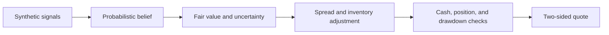

# Adaptive Event Market Maker — Conceptual Demo

> **Release status:** Private draft pending confirmation that public disclosure
> is permitted.

Selected as one of 15 finalists in Akuna Capital's 2026 Virtual Quant Trading
Challenge. This project illustrates general ideas from that work.

This is a simplified educational reconstruction—not the
competition prompt, starter code, test suite, data, screenshots, or submitted
implementation. All examples are synthetic and all parameters are illustrative.
This project is not affiliated with or endorsed by Akuna Capital.

## Strategy in one minute

The strategy treats a binary contract's estimated probability as its fair value,
then adjusts the market around that estimate:

- combine correlated signals instead of treating them as independent;
- widen prices when the estimate is uncertain or recent flow looks adverse;
- move the quote center and reduce size as inventory accumulates;
- scale down risk during drawdowns.



## What the demo shows

`strategy_demo.py` contains three deliberately compact components:

1. A Gaussian update that combines two noisy, correlated observations of a
   latent event score and converts the result into a binary probability.
2. An adaptive quoter that uses uncertainty, inventory, adverse-flow estimates,
   available cash, and drawdown to set prices and sizes.
3. A bounded exponentially weighted adverse-flow tracker based on the movement
   in fair value after a fill.

The result is a readable sketch of the decision process, not a backtest or a
claim of expected profitability.

## Run it

Python 3.10 or newer is sufficient and there are no third-party dependencies.

```bash
python strategy_demo.py
python -m unittest -v
```

## Scope

This separate demo uses synthetic examples and covers only general modeling and
risk-management concepts. It cannot reproduce or benchmark the original entry.

## Limitations

- The belief model has one latent score and two synthetic signals.
- The risk controls cover one binary contract, not a full portfolio.
- There is no exchange connection, latency model, persistence, or execution
  simulator.
- This software is not intended for live trading or investment decisions.
